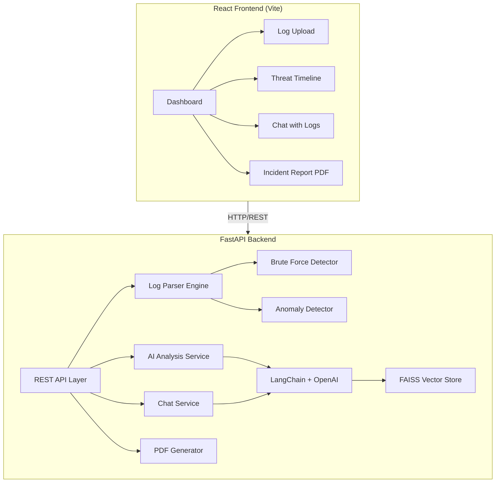

# AI Security Analyst for Small Businesses

A full-stack AI-powered cybersecurity assistant that scans server logs, detects suspicious activity, explains threats in plain language, suggests fixes, and generates incident report PDFs — all through a premium dark-themed dashboard.

## Architecture Overview



## User Review Required

> [!IMPORTANT]
> **AI Provider Choice**: The plan uses **OpenAI API** (GPT-4o-mini) as the default LLM. If you prefer **Ollama** for local/free inference, I can configure that instead. OpenAI requires an API key.

> [!IMPORTANT]
> **Sample Logs**: I will include realistic sample log files (auth.log, syslog, Apache access.log formats) so the app is immediately demo-able without a real Linux server.

> [!WARNING]
> **API Key Security**: The OpenAI API key will be stored in a `.env` file (never committed). You'll need to provide your own key before running the AI features.

## Open Questions

1. **OpenAI vs Ollama**: Do you want OpenAI API (cloud, paid, more powerful) or Ollama (local, free, requires model download)? I'll default to **OpenAI** with easy Ollama swap.
2. **Authentication**: Should the dashboard have user login/auth, or is it a single-user local tool for now?
3. **Real-time monitoring**: Should log analysis be one-shot (upload → analyze) or include a live tail/monitoring mode?

---

## Proposed Changes

### Project Structure

```
New folder/
├── backend/
│   ├── app/
│   │   ├── __init__.py
│   │   ├── main.py                 # FastAPI app entry point
│   │   ├── config.py               # Settings & environment variables
│   │   ├── models/
│   │   │   ├── __init__.py
│   │   │   └── schemas.py          # Pydantic models
│   │   ├── services/
│   │   │   ├── __init__.py
│   │   │   ├── log_parser.py       # Log parsing engine (auth, syslog, apache)
│   │   │   ├── threat_detector.py  # Brute-force & anomaly detection
│   │   │   ├── ai_analyzer.py      # LangChain AI analysis service
│   │   │   ├── vector_store.py     # FAISS vector store management
│   │   │   ├── chat_service.py     # RAG chat with logs
│   │   │   └── pdf_generator.py    # ReportLab PDF incident reports
│   │   └── routers/
│   │       ├── __init__.py
│   │       ├── logs.py             # Log upload & analysis endpoints
│   │       ├── chat.py             # Chat with logs endpoints
│   │       └── reports.py          # PDF report endpoints
│   ├── sample_logs/
│   │   ├── auth.log                # Sample SSH auth log
│   │   ├── syslog.log              # Sample syslog
│   │   └── access.log              # Sample Apache access log
│   ├── requirements.txt
│   ├── .env.example
│   └── README.md
├── frontend/
│   ├── src/
│   │   ├── index.css               # Global design system
│   │   ├── App.jsx                 # Main app with routing
│   │   ├── App.css                 # App-level styles
│   │   ├── components/
│   │   │   ├── Dashboard.jsx       # Main dashboard layout
│   │   │   ├── Dashboard.css
│   │   │   ├── LogUpload.jsx       # Drag & drop log uploader
│   │   │   ├── LogUpload.css
│   │   │   ├── ThreatCard.jsx      # Individual threat display card
│   │   │   ├── ThreatCard.css
│   │   │   ├── ThreatTimeline.jsx  # Timeline of detected threats
│   │   │   ├── ThreatTimeline.css
│   │   │   ├── ChatPanel.jsx       # Chat with logs interface
│   │   │   ├── ChatPanel.css
│   │   │   ├── AnalysisSummary.jsx # AI attack summary panel
│   │   │   ├── AnalysisSummary.css
│   │   │   ├── StatsBar.jsx        # Top stats/KPI bar
│   │   │   ├── StatsBar.css
│   │   │   ├── Sidebar.jsx         # Navigation sidebar
│   │   │   └── Sidebar.css
│   │   └── utils/
│   │       └── api.js              # API client functions
│   ├── public/
│   │   └── favicon.svg
│   ├── index.html
│   ├── package.json
│   └── vite.config.js
└── README.md
```

---

### Backend — Core API

#### [NEW] [main.py](file:///c:/Users/sandy/Desktop/New%20folder%20(3)/New%20folder/backend/app/main.py)
- FastAPI application factory with CORS middleware
- Mount routers for `/api/logs`, `/api/chat`, `/api/reports`
- Health check endpoint
- Static file serving for uploaded logs
- Lifespan event to initialize FAISS vector store

#### [NEW] [config.py](file:///c:/Users/sandy/Desktop/New%20folder%20(3)/New%20folder/backend/app/config.py)
- Pydantic `Settings` class loading from `.env`
- `OPENAI_API_KEY`, `MODEL_NAME`, `UPLOAD_DIR`, `VECTOR_STORE_DIR`
- Configurable thresholds for brute-force detection

#### [NEW] [schemas.py](file:///c:/Users/sandy/Desktop/New%20folder%20(3)/New%20folder/backend/app/models/schemas.py)
- `LogEntry`: parsed log line (timestamp, source_ip, action, severity, raw_line)
- `ThreatDetection`: detected threat (type, severity, source_ip, count, description, recommendation)
- `AnalysisResult`: full analysis response (summary, threats[], stats, risk_score)
- `ChatMessage` / `ChatResponse`: chat interaction models
- `IncidentReport`: PDF report data model

---

### Backend — Services

#### [NEW] [log_parser.py](file:///c:/Users/sandy/Desktop/New%20folder%20(3)/New%20folder/backend/app/services/log_parser.py)
- **Auto-detect** log format (auth.log, syslog, Apache access.log)
- Regex-based line-by-line parsing extracting:
  - Timestamp, hostname, service, PID, message
  - Source IP, username, action (success/failure)
- Normalize all formats into unified `LogEntry` objects
- Handle large files via streaming/chunked processing

#### [NEW] [threat_detector.py](file:///c:/Users/sandy/Desktop/New%20folder%20(3)/New%20folder/backend/app/services/threat_detector.py)
- **Brute-force detection**: Track failed login attempts per IP within sliding time windows (configurable threshold, default: 5 failures in 10 minutes)
- **Port scanning detection**: Multiple connection attempts to different ports from same IP
- **Unusual hour access**: Login attempts at unusual hours (configurable)
- **Root/admin escalation**: Detect privilege escalation attempts
- **Geographic anomaly**: Flag IPs from unexpected regions (optional)
- Returns `ThreatDetection[]` with severity levels (Critical/High/Medium/Low)

#### [NEW] [ai_analyzer.py](file:///c:/Users/sandy/Desktop/New%20folder%20(3)/New%20folder/backend/app/services/ai_analyzer.py)
- LangChain integration with OpenAI (GPT-4o-mini default)
- **Summarize attacks**: Takes parsed threats and generates plain-English summaries
- **Explain threats**: "What does this brute-force attempt mean for my business?"
- **Suggest fixes**: Actionable, non-technical remediation steps
  - e.g., "Block IP X with: `sudo ufw deny from 192.168.1.100`"
- **Risk scoring**: Overall risk score (0-100) with business impact assessment
- Uses structured output via Pydantic models for consistency

#### [NEW] [vector_store.py](file:///c:/Users/sandy/Desktop/New%20folder%20(3)/New%20folder/backend/app/services/vector_store.py)
- FAISS vector store initialization and management
- **Ingest logs**: Split parsed log entries into chunks, generate embeddings via OpenAI, store in FAISS
- **Similarity search**: Find relevant log entries for a given query
- **Persist/load**: Save and reload FAISS index from disk
- Uses LangChain's `FAISS` wrapper with `OpenAIEmbeddings`

#### [NEW] [chat_service.py](file:///c:/Users/sandy/Desktop/New%20folder%20(3)/New%20folder/backend/app/services/chat_service.py)
- RAG (Retrieval-Augmented Generation) pipeline
- User asks: *"Why was IP 192.168.1.100 blocked?"*
- Pipeline:
  1. Search FAISS for relevant log entries
  2. Build context from retrieved entries
  3. Send to LLM with system prompt for security analyst persona
  4. Return plain-English response with evidence from logs
- Conversation memory (last 10 messages) for contextual follow-ups

#### [NEW] [pdf_generator.py](file:///c:/Users/sandy/Desktop/New%20folder%20(3)/New%20folder/backend/app/services/pdf_generator.py)
- ReportLab Platypus-based professional PDF generation
- **Incident Report** includes:
  - Header with company name, date, report ID
  - Executive summary (AI-generated)
  - Threat breakdown table (type, severity, IP, count)
  - Detailed findings with recommendations
  - Risk score gauge/visualization
  - Timeline of events
- Styled with professional layout, colors, and typography

---

### Backend — API Routers

#### [NEW] [logs.py](file:///c:/Users/sandy/Desktop/New%20folder%20(3)/New%20folder/backend/app/routers/logs.py)
- `POST /api/logs/upload` — Upload log file(s), parse, detect threats, run AI analysis
- `GET /api/logs/analysis/{analysis_id}` — Get analysis results
- `GET /api/logs/threats/{analysis_id}` — Get detected threats list
- `GET /api/logs/stats/{analysis_id}` — Get statistics (total lines, unique IPs, etc.)

#### [NEW] [chat.py](file:///c:/Users/sandy/Desktop/New%20folder%20(3)/New%20folder/backend/app/routers/chat.py)
- `POST /api/chat/message` — Send message and get AI response
- `GET /api/chat/history` — Get conversation history
- `DELETE /api/chat/history` — Clear conversation

#### [NEW] [reports.py](file:///c:/Users/sandy/Desktop/New%20folder%20(3)/New%20folder/backend/app/routers/reports.py)
- `POST /api/reports/generate/{analysis_id}` — Generate PDF incident report
- `GET /api/reports/download/{report_id}` — Download generated PDF

---

### Backend — Sample Data

#### [NEW] [auth.log](file:///c:/Users/sandy/Desktop/New%20folder%20(3)/New%20folder/backend/sample_logs/auth.log)
- ~200 lines of realistic auth.log entries
- Includes successful logins, failed SSH attempts, brute-force patterns from specific IPs, sudo usage

#### [NEW] [syslog.log](file:///c:/Users/sandy/Desktop/New%20folder%20(3)/New%20folder/backend/sample_logs/syslog.log)
- ~150 lines of syslog entries
- Includes kernel messages, service restarts, firewall blocks

#### [NEW] [access.log](file:///c:/Users/sandy/Desktop/New%20folder%20(3)/New%20folder/backend/sample_logs/access.log)
- ~200 lines of Apache access log
- Includes normal traffic, SQL injection attempts, directory traversal, 404 scanning

---

### Frontend — Design System & UI

#### Design Philosophy
- **Dark cybersecurity theme**: Deep navy/charcoal backgrounds (`#0a0e1a`, `#111827`)
- **Accent colors**: Electric cyan (`#00f0ff`), warning amber (`#f59e0b`), critical red (`#ef4444`), success emerald (`#10b981`)
- **Glassmorphism**: Frosted glass cards with `backdrop-filter: blur()`
- **Typography**: Inter font from Google Fonts
- **Micro-animations**: Pulse effects on threat indicators, smooth transitions, typing animation in chat
- **Grid-based layout**: CSS Grid for responsive dashboard panels

#### [NEW] [index.css](file:///c:/Users/sandy/Desktop/New%20folder%20(3)/New%20folder/frontend/src/index.css)
- CSS custom properties (design tokens): colors, spacing, radii, shadows, transitions
- Reset and base styles
- Typography scale
- Utility classes for glassmorphism, animations, severity colors
- Scrollbar styling for dark theme

#### [NEW] [App.jsx](file:///c:/Users/sandy/Desktop/New%20folder%20(3)/New%20folder/frontend/src/App.jsx)
- Main app shell with Sidebar + content area
- State management for current analysis, active view
- API integration layer

#### [NEW] [Sidebar.jsx](file:///c:/Users/sandy/Desktop/New%20folder%20(3)/New%20folder/frontend/src/components/Sidebar.jsx)
- Logo + brand
- Navigation items: Dashboard, Upload Logs, Chat, Reports
- Active state indicator with glow effect
- Collapsible on mobile

#### [NEW] [Dashboard.jsx](file:///c:/Users/sandy/Desktop/New%20folder%20(3)/New%20folder/frontend/src/components/Dashboard.jsx)
- Main dashboard with CSS Grid layout
- Orchestrates: StatsBar, ThreatTimeline, AnalysisSummary, ChatPanel
- Loading/empty states with skeleton animations

#### [NEW] [StatsBar.jsx](file:///c:/Users/sandy/Desktop/New%20folder%20(3)/New%20folder/frontend/src/components/StatsBar.jsx)
- Top KPI cards: Total Events, Threats Detected, Risk Score, Unique IPs
- Animated count-up numbers
- Severity-based color coding
- Glassmorphism card styling

#### [NEW] [LogUpload.jsx](file:///c:/Users/sandy/Desktop/New%20folder%20(3)/New%20folder/frontend/src/components/LogUpload.jsx)
- Drag-and-drop zone with visual feedback
- File type validation (.log, .txt)
- Upload progress bar with percentage
- Sample log quick-load buttons for demo
- Processing animation during analysis

#### [NEW] [ThreatCard.jsx](file:///c:/Users/sandy/Desktop/New%20folder%20(3)/New%20folder/frontend/src/components/ThreatCard.jsx)
- Individual threat display with severity badge
- Threat type icon, source IP, attempt count
- AI-generated description in plain English
- Expandable recommendation section
- Severity-based left border color

#### [NEW] [ThreatTimeline.jsx](file:///c:/Users/sandy/Desktop/New%20folder%20(3)/New%20folder/frontend/src/components/ThreatTimeline.jsx)
- Vertical timeline of detected threats
- Time-ordered with severity indicators
- Interactive: click to expand details
- Animated entry on scroll

#### [NEW] [AnalysisSummary.jsx](file:///c:/Users/sandy/Desktop/New%20folder%20(3)/New%20folder/frontend/src/components/AnalysisSummary.jsx)
- AI-generated attack summary in card format
- Risk score gauge (circular progress)
- Key findings bullets
- Top attacking IPs table
- Recommendations list

#### [NEW] [ChatPanel.jsx](file:///c:/Users/sandy/Desktop/New%20folder%20(3)/New%20folder/frontend/src/components/ChatPanel.jsx)
- Chat interface similar to modern AI assistants
- Message bubbles with user/AI distinction
- Typing indicator animation
- Suggested questions: *"Why was this IP blocked?"*, *"Show me all failed logins"*, *"What should I do next?"*
- Auto-scroll to latest message
- Clear history button

#### [NEW] [api.js](file:///c:/Users/sandy/Desktop/New%20folder%20(3)/New%20folder/frontend/src/utils/api.js)
- Axios/fetch wrapper for all API calls
- Base URL configuration
- Error handling utilities
- Functions: `uploadLogs()`, `getAnalysis()`, `sendChatMessage()`, `generateReport()`, `downloadReport()`

---

## Verification Plan

### Automated Tests

1. **Backend startup**: `uvicorn app.main:app` starts without errors
2. **Log parsing**: Upload each sample log file and verify parsing output
3. **Threat detection**: Verify brute-force detection triggers on sample auth.log
4. **API endpoints**: Test all REST endpoints return correct schemas
5. **Frontend build**: `npm run build` completes without errors

### Manual Verification (Browser Testing)

1. **Upload flow**: Drag-and-drop a sample log → see parsing progress → view results
2. **Dashboard**: Verify all panels render with data, animations work
3. **Chat**: Ask questions about uploaded logs, verify relevant responses
4. **PDF**: Generate and download incident report, verify content
5. **Responsive**: Test dashboard at different viewport sizes
6. **Visual quality**: Verify dark theme, glassmorphism, animations meet premium standard

### Demo Walkthrough
1. Start backend + frontend
2. Upload sample `auth.log` from dashboard
3. View threat detections (brute-force attempts should appear)
4. Read AI-generated summary
5. Chat: *"Why was 192.168.1.100 flagged?"*
6. Generate and download PDF incident report
